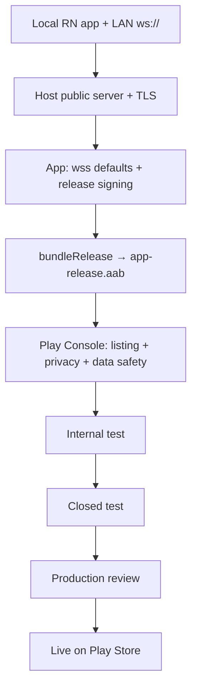

# Play Store publish flow — Raja Chor Mantri Sipahi

Step-by-step path from this React Native project to a live Google Play listing. Do the **pre-publish work** first; uploading a debug-signed or cleartext-only build will fail review or production use.

---

## Overview (checklist)

```
1. Production server (WSS)     ──► 2. App production config
3. Release signing keystore   ──► 4. Version + multi-ABI release AAB
5. Store assets + privacy     ──► 6. Play Console account + app create
7. Content rating / data form ──► 8. Upload AAB (internal test)
9. Closed / open testing      ──► 10. Production release
```

---

## Phase 0 — Decide how multiplayer works in production

Today the app talks **`ws://`** to a machine on the LAN (or emulator `10.0.2.2`). Play users cannot reach your laptop.

Pick one:

| Option | Who hosts | App change |
|--------|-----------|------------|
| **A. Public game server** (recommended) | You host `server.py` (or a hardened fork) behind HTTPS reverse proxy with **WSS** | Default host = your domain; prefer `wss://` |
| **B. Host-on-LAN only** | Players bring their own server | Keep host field; document setup; still need Play policies + signing |

Play Store itself does not host your WebSocket server. Without a reachable backend, Host/Join will fail for real users.

**Recommended production shape:**

```
Phone (wss://game.yourdomain.com)
        │
        ▼
Nginx / Caddy (TLS termination)
        │
        ▼
Python server.py (localhost:8765)
```

Also plan for: process manager (systemd / Docker), firewall, optional multiple rooms later (current server is single-room).

---

## Phase 1 — Production-ready app changes

### 1.1 Secure WebSockets

1. Deploy server with TLS → `wss://your.domain`.
2. Update `src/config.ts` / Join screen defaults to that host.
3. Change `buildWsUrl` to support `wss://` (not only `ws://`).
4. For release builds, **turn off blanket cleartext**:
   - Remove or restrict `android:usesCleartextTraffic="true"`
   - Tighten `network_security_config.xml` (no open cleartext base-config in production)

Keep cleartext only in `debug` if you still need LAN testing.

### 1.2 Release signing (required)

`android/app/build.gradle` currently signs **release with the debug keystore**. Play will not accept that for production (and you must not ship debug keys).

Generate a keystore (once; **back up offline**):

```bash
keytool -genkeypair -v -storetype PKCS12 -keystore rcms-upload.keystore -alias rcms -keyalg RSA -keysize 2048 -validity 10000
```

Store passwords in `android/keystore.properties` (do **not** commit):

```properties
storePassword=***
keyPassword=***
keyAlias=rcms
storeFile=../rcms-upload.keystore
```

Wire into `android/app/build.gradle` (pattern):

```gradle
def keystorePropertiesFile = rootProject.file("keystore.properties")
def keystoreProperties = new Properties()
if (keystorePropertiesFile.exists()) {
    keystoreProperties.load(new FileInputStream(keystorePropertiesFile))
}

android {
    signingConfigs {
        release {
            if (keystorePropertiesFile.exists()) {
                keyAlias keystoreProperties['keyAlias']
                keyPassword keystoreProperties['keyPassword']
                storeFile file(keystoreProperties['storeFile'])
                storePassword keystoreProperties['storePassword']
            }
        }
    }
    buildTypes {
        release {
            signingConfig signingConfigs.release
            // minifyEnabled true  // optional later
        }
    }
}
```

Add to `mobile/android/.gitignore` (or root `.gitignore`):

```
keystore.properties
*.keystore
!app/debug.keystore
```

Losing this keystore = you cannot update the same Play app forever (unless you use Play App Signing and still control the upload key carefully).

### 1.3 Version bump every upload

In `android/app/build.gradle` → `defaultConfig`:

- `versionCode` — integer, **must increase** each Play upload (`1`, `2`, `3`…)
- `versionName` — user-facing (`"1.0.0"`, `"1.0.1"`…)

### 1.4 Architectures for store builds

Dev uses `reactNativeArchitectures=arm64-v8a` only. For Play, build with common ABIs, e.g.:

```bash
cd mobile/android
gradlew.bat bundleRelease -PreactNativeArchitectures=armeabi-v7a,arm64-v8a,x86,x86_64
```

Or set that in `gradle.properties` for release CI.

### 1.5 App identity polish

- Confirm `applicationId` `com.rajachormantrisipahi` is final (cannot change later without a new listing).
- Launcher name: `res/values/strings.xml` → `app_name`.
- Replace default launcher icons under `res/mipmap-*` with final art (adaptive icon recommended).
- Smoke-test **release** build on a real phone before Console upload.

---

## Phase 2 — Build the Play artifact (AAB)

Google Play requires an **Android App Bundle** (`.aab`), not a raw debug APK.

```powershell
cd mobile
npm install
npm test
npm run lint

cd android
.\gradlew.bat clean
.\gradlew.bat bundleRelease -PreactNativeArchitectures=armeabi-v7a,arm64-v8a,x86,x86_64
```

Output:

```text
mobile/android/app/build/outputs/bundle/release/app-release.aab
```

Optional local install check (APK):

```powershell
.\gradlew.bat assembleRelease
# outputs apk under app/build/outputs/apk/release/
```

Install release APK only for QA — upload the **AAB** to Play.

---

## Phase 3 — Google Play Console account

1. Open [Google Play Console](https://play.google.com/console).
2. Pay the one-time **developer registration** fee (personal or organization).
3. Complete developer identity / verification (can take days).
4. **Create app** → name e.g. `Raja Chor Mantri Sipahi` → default language → Free/Paid → declarations.

Use the same Google account you will keep long-term for this listing.

---

## Phase 4 — Store listing assets (prepare before upload)

You need these in Console → **Grow → Store presence → Main store listing** (names can vary slightly):

| Asset | Typical requirement |
|-------|---------------------|
| App name | ≤ 30 characters |
| Short description | ≤ 80 characters |
| Full description | ≤ 4000 characters |
| App icon | 512 × 512 PNG |
| Feature graphic | 1024 × 500 |
| Phone screenshots | ≥ 2 (portrait), various size rules apply |
| Privacy policy URL | **Required** (public HTTPS page) |

Write copy that matches real behaviour: local/online multiplayer, roles Raja/Chor/Mantri/Sipahi, no gambling framing unless you actually add it.

### Privacy policy (minimum topics)

Even without accounts, mention:

- What data you collect (often: none, or only nickname in-memory / on your server)
- That gameplay goes over the network to your server
- Whether you use analytics / ads (this app currently does not — say so if true)
- Contact email
- Children’s / family policy if you target kids (see content rating)

Host on GitHub Pages, Notion public page, or your domain.

---

## Phase 5 — Policy & questionnaire forms

In Play Console, complete before production:

1. **App content → Privacy policy** — paste URL  
2. **Data safety** — declare data collected/shared (nicknames? IP on server logs?)  
3. **Ads** — declare if you show ads  
4. **Content rating** — IARC questionnaire (party / casual game)  
5. **Target audience** — age groups  
6. **News / COVID / financial** — usually “No”  
7. **Government apps** — No  
8. **App access** — if login-free, say all features available without special access  

Mis-declaring Data safety is a common rejection reason.

---

## Phase 6 — Upload & testing tracks

### 6.1 Internal testing (do this first)

1. **Release → Testing → Internal testing**  
2. Create release → upload `app-release.aab`  
3. Add release notes  
4. Add testers (email list)  
5. Roll out internal → install via opt-in link  

Validate:

- Fresh install from Play link  
- Connect to **production WSS** server  
- Full match: host setup → roles → Sipahi guess → scoreboard → game over  
- Background / screen rotate / reconnect behaviour (know limits: no mid-game resume)

### 6.2 Closed testing (recommended before production)

Required in many regions / for new personal accounts before production:

1. Closed testing track  
2. Larger tester group  
3. Keep build live for the period Google requires for your account type  
4. Fix crashes from Play pre-launch report / vitals  

### 6.3 Production

1. **Release → Production** → create release from promoted AAB (or new upload)  
2. Countries / rollout % (start 20% if nervous)  
3. Submit for review  

Review often takes **hours to several days**. Watch email + Console inbox for policy questions.

---

## Phase 7 — After go-live

| Task | Why |
|------|-----|
| Monitor **Android Vitals** | Crashes / ANRs |
| Keep server up + TLS cert renewed | App is useless if WSS dies |
| Bump `versionCode` on every fix | Required for updates |
| Play App Signing | Google re-signs; keep upload keystore safe |
| Respond to reviews | Store hygiene |

---

## End-to-end flow (visual)



---

## Common rejection / failure causes for *this* project

1. **Debug-signed release** — fix signing before upload.  
2. **Cleartext / broken networking** — production must reach a real `wss` host.  
3. **Missing privacy policy** — always required.  
4. **Data safety mismatch** — declare nicknames / server processing honestly.  
5. **Incomplete testing track** — new accounts often blocked from jumping straight to production.  
6. **Misleading screenshots / gambling wording** — keep copy accurate.  
7. **Wrong package / key** — never create a second app with a new signing key for the “same” package; updates must match.

---

## Quick command cheat sheet

```powershell
# From mobile/
npm test
cd android
.\gradlew.bat bundleRelease -PreactNativeArchitectures=armeabi-v7a,arm64-v8a,x86,x86_64

# Artifact
# app\build\outputs\bundle\release\app-release.aab
```

---

## Related docs

- [Developer documentation](./DEVELOPER.md)
- [React Native signed APK / AAB](https://reactnative.dev/docs/signed-apk-android)
- [Play Console help](https://support.google.com/googleplay/android-developer)
